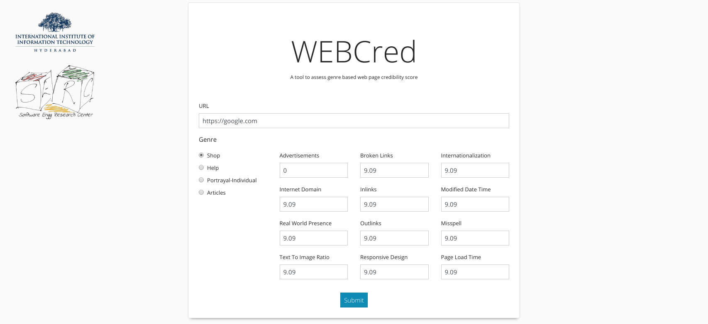

# Installation
- Set up the environment using [pipenv](https://github.com/pypa/pipenv)
   - Install pipenv [Instructions](https://github.com/pypa/pipenv#installation)
   - `$:pipenv install`
   - Install postgres (google it yourself for your system)
   
- Configure postgres:
   - Create new db
        
        `$: create database __name__`
   - Create password for postgresql
        
        `$: psql postres`
        
        `$: \password`

- Populate the environment variables listed in `env.sample` into `.env` 
with correct values.
        
        Conventionally,
        port=5432

- Make and apply migrations
    
    `$:python manage.py migrations`

- Start the webserver
    
    `$:python manage.py runserver`
    

Based on the original WEBCred application [here](https://github.com/Shriyanshagro/WEBCred)

